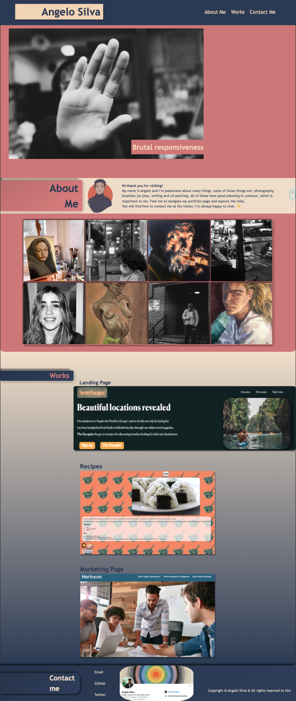

# Portfolio_Project_2

## Table of contents
1. [The repository](#the-repository)
2. [Portfolio](#portfolio)
3. [Learned](#learned)
4. [Feedback](#feedback)
5. [License](#license)

### The repository

This repository contains the second project for the Edx bootcamp. The goal of this project is to create a portfolio website to host our projects.

### Portfolio

>Having a portfolio website is important because it allows you to showcase your work and accomplishments in a professional manner. A portfolio website serves as an online resume, highlighting your skills and experiences for potential employers or clients. It can also help you to stand out in a crowded job market, as it gives you a platform to demonstrate your unique value proposition.

>A portfolio website can also be a useful tool for networking and connecting with others in your industry. By sharing your portfolio website with others, you can attract new opportunities and collaborations.

>In addition, a portfolio website is a great way to establish your personal brand and showcase your style and approach to work. This can be particularly important if you are a freelancer or entrepreneur, as it allows you to present yourself as a professional and establish your reputation in your field.

>Overall, having a portfolio website can be a valuable asset for anyone looking to advance their career or attract new business.

### Learned:
- I learned a lot about practical web development skills and techniques.
- I had the opportunity to apply what I had learned about website design, user experience, and web development best practices as I created and refined my site.
- I also had the chance to practice and improve my coding skills, as well as learn new ones, as I built and tested my site.
- I learned about project management and organization as I planned and executed my website development project.
- I gained insight into current trends and best practices in the field.

### Feedback

You can [Tweet](https://twitter.com/pandersail) me with a question or provide feedback. :+1:

### License

MIT License

Copyright (c) 2022 Angelo

*Permission is hereby granted, free of charge, to any person obtaining a copy*
*of this software and associated documentation files (the "Software"), to deal*
*in the Software without restriction, including without limitation the rights*
*to use, copy, modify, merge, publish, distribute, sublicense, and/or sell*
*copies of the Software, and to permit persons to whom the Software is*
*furnished to do so, subject to the following conditions:*

*The above copyright notice and this permission notice shall be included in all*
*copies or substantial portions of the Software.*

*THE SOFTWARE IS PROVIDED "AS IS", WITHOUT WARRANTY OF ANY KIND, EXPRESS OR*
*IMPLIED, INCLUDING BUT NOT LIMITED TO THE WARRANTIES OF MERCHANTABILITY,*
*FITNESS FOR A PARTICULAR PURPOSE AND NONINFRINGEMENT. IN NO EVENT SHALL THE*
*AUTHORS OR COPYRIGHT HOLDERS BE LIABLE FOR ANY CLAIM, DAMAGES OR OTHER*
*LIABILITY, WHETHER IN AN ACTION OF CONTRACT, TORT OR OTHERWISE, ARISING FROM,*
*OUT OF OR IN CONNECTION WITH THE SOFTWARE OR THE USE OR OTHER DEALINGS IN THE*
*SOFTWARE.*
